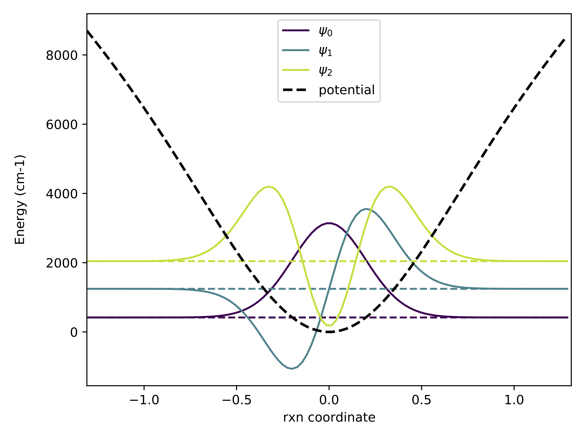

# CGH_Toolbox

# Purpose
A rudimentary Python Package to hold all my code for Quantum chem research. It is all puprose-built and much of it too specific for generic use. 

# DVR
code built to perform a Discrete Variable Representation as described by Colbert and Miller

# DVR Arrays
DVRs solve the vibrational shrödinger equation for systems with known potential energy surfaces using matrix representation of quantum mechanical operators. This code builds those matrices using Python.

# Gaussian Tools
Utilites for interfacing with Gaussian Electronic Strucutre Calculation software. Gaussian is written in fortran and its input and output is based on text files. Much of this code is writing and reading text files with a specific format

# Utilities
This is the most generic code here. It holds a lot of the basic utilites used by the other code. Much of this could be its own package and could be used for more than comp chem research
